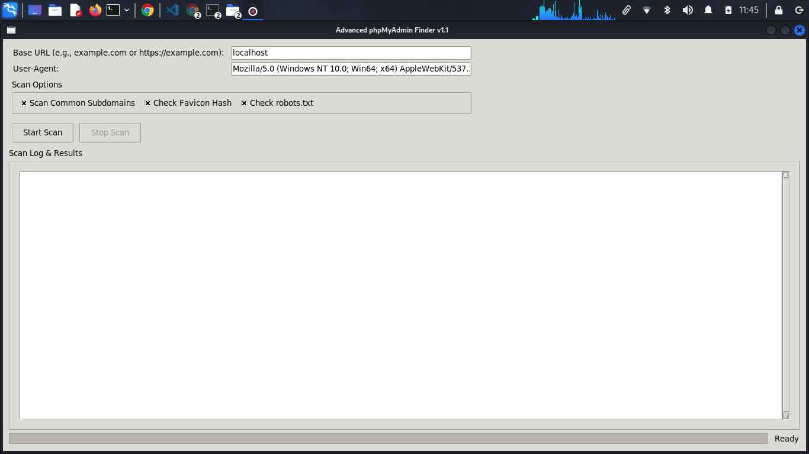

# Advanced phpMyAdmin (PMA) Finder


A graphical, multi-threaded scanner built with Python and Tkinter for discovering hidden or non-standard phpMyAdmin login panels on web servers. It employs multiple scanning techniques to provide comprehensive and efficient detection.

## Features

- User-Friendly GUI: Intuitive interface powered by Tkinter.
- Multi-Threaded Scanning: Ensures the UI remains responsive during scans.
- Extensive Path Coverage: Scans over 40 common and obscure phpMyAdmin paths.
- Subdomain Scanning: Optionally scans popular subdomains such as `db.example.com` or `mysql.example.com`.
- Multi-Port Support: Checks common web ports including 80, 443, 8080, 2083, and 10000.
- Smart Detection:
  - Keyword matching in page content and titles.
  - Favicon hash comparison against known phpMyAdmin icons.
  - `robots.txt` analysis for `Disallow` entries hinting at panel locations.
- Real-Time Colored Logging: Provides live, color-coded scan updates.
- Scan Cancellation: Easily stop scans anytime through the interface.
- Custom User-Agent: Allows setting a custom User-Agent string for HTTP requests.

## Screenshot

  
_The GUI allows you to input the target URL, select scan options, and view live scan logs._

## Requirements

- Python 3.6 or higher
- `requests` Python library

## Installation & Usage

### 1. Clone the Repository

```bash
git clone https://github.com/Dilip98352/phpmyadmin-finder-tool.git
cd phpmyadmin-finder-tool
```
````

### 2. (Recommended) Create and Activate a Virtual Environment

On macOS/Linux:

```bash
python3 -m venv venv
source venv/bin/activate
```

On Windows (PowerShell):

```powershell
python -m venv venv
.\venv\Scripts\activate
```

### 3. Install Dependencies

```bash
pip install -r requirements.txt
```

### 4. Run the Application

```bash
python3 app.py
```

## How to Use

1. Launch the application.
2. Enter the target URL or domain (e.g., `example.com`).
3. Select desired scan options (subdomains, favicon checking, ports, etc.).
4. Click Start Scan.
5. Watch the Scan Log & Results section for live feedback.
6. If a phpMyAdmin panel is detected, a success message and notification will appear.
7. Click Stop Scan anytime to cancel ongoing scans.

## Disclaimer

This tool is intended strictly for educational and authorized penetration testing purposes. Unauthorized scanning is illegal and unethical. The author holds no responsibility for misuse or damages caused by this software. Always obtain explicit permission before scanning any websites.

## License

This project is licensed under the [MIT License](LICENSE).

## Support & Coffee ☕️

If you find this tool helpful, please consider supporting development by buying me a coffee:

[](coff.ee/user03863g)

```

---

If you want, I can also help you add badges for GitHub Actions (CI), PyPI, or code quality if you plan to add those later! Would you like me to?
```
